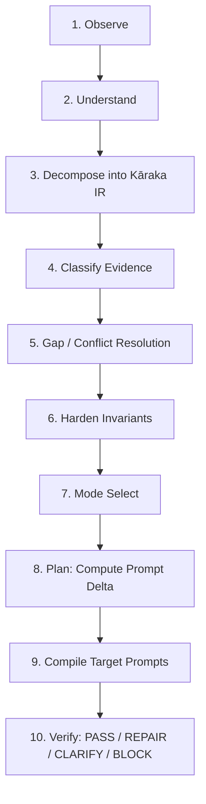

# Aasha-AIOS Adaptive Semantic Prompt Compiler & Architectural Guide
*Formal Pāṇinian Kāraka Computational Semantics, Prompt Delta Engine, and HIL Governance*

## 1. System-Level Architecture & Core Purpose

### Fundamental Boundaries & Invariants
1. **SKILL != SYSTEM**:
   This compiler is strictly a pluggable execution skill and prompt orchestration plugin, not the application system itself. It introduces **zero changes** to the existing repository build plan, core runtime, or architecture. All outputs are generated as explicit proposals, contracts, or isolated artifacts.
2. **UNIVERSAL K–12 SCOPE**:
   Operates across any school, any educational board (CBSE, ICSE, NCERT, State Boards, Cambridge, IB), any subject (Mathematics, Science, Social Science, Languages, Coding, Financial Literacy), and any grade from Kindergarten to 12th Grade (K–12).
3. **KID'S OWN BOOK FIRST**:
   The non-negotiable pedagogical invariant. All learning modules, interactive simulations, worked examples, and formative checks are derived directly from the child's own prescribed textbook first as the authoritative source of truth, avoiding disconnected or synthetic curriculum hallucinations.
4. **REFINE != REINVENT**:
   Multi-turn interactions increase precision and clarity without causing intent drift, dropped textbook exercises, or mutated architectural constraints.
5. **READ & EVALUATE FIRST — NEVER AUTO-MUTATE**:
   This is strictly a custom evaluation and semantic compilation skill for our project, not the full ecosystem itself. Merely possessing or loading this skill gives **zero authority** to automatically modify or mutate codebase files, existing chapters, or runtime systems. An agent MUST always:
   - **First Read**: Inspect existing source files, contracts, and textbook context.
   - **Then Evaluate**: Run Pāṇinian Kāraka decomposition, check evidence classes, and calculate deltas.
   - **Generate Isolated Proposal**: Emit the developer proposal and teacher summary (`शिक्षक के लिए सारांश`).
   - **Await Explicit Human Review**: Never apply code changes until the proposal has been explicitly reviewed and approved by the user.

### 4-Layer Aasha-AIOS Placement

```
+-----------------------------------------------------------------------+
| Layer 4: Extensions & Multi-Agent Orchestration                       |
|   - aasha-prompt-compiler (This Skill)                                |
|   - Multi-agent coordination (Analyze, Design, Assess, LLE, QA)       |
|   - Graphify & Mem0 Memory Connectors                                 |
+-----------------------------------------------------------------------+
| Layer 3: Product UI                                                   |
|   - Student PWA (Offline-first, touch targets >=44px)                 |
|   - Teacher HIL Verification Portal (शिक्षक के लिए सारांश)             |
+-----------------------------------------------------------------------+
| Layer 2: Education Engine                                             |
|   - Universal K-12 Curriculum & Kid's Own Book First Invariant        |
|   - Prebuilt Foundation Registry (F01-F20)                            |
|   - Bilingual Vernacular Substrate (LLE, CONN, Hindi focus)           |
+-----------------------------------------------------------------------+
| Layer 1: Core Runtime                                                 |
|   - Offline execution, IndexedDB / localStorage                       |
|   - <20MB bundle limits, zero external CDN/font calls                 |
+-----------------------------------------------------------------------+
```

---

## 2. Indic Computational Abstractions (Pure Software Engineering)

The compiler leverages four classical Indic computational formalisms implemented as modern software engineering patterns:

### 1. Pāṇinian Kāraka Semantic Intermediate Representation (IR)
Every natural-language instruction, task, or educational specification is decomposed into the 6 invariant semantic roles:

| Kāraka (Sanskrit) | Semantic Role | Aasha-AIOS Computational Mapping | Example in Chapter Generation |
| :--- | :--- | :--- | :--- |
| **Kartā** (कर्तृ) | Agent / Subject | The autonomous agent, orchestrator, or user driving the action. | `AssessmentAgent`, `Teacher-Admin` |
| **Karma** (कर्मन्) | Patient / Object | The target entity being produced, analyzed, or transformed. | `Section 24 Contract`, `Worked Example 3` |
| **Karaṇa** (करण) | Instrument / Means | The tools, methods, algorithms, and foundations utilized. | `math_insulator.ts`, `registry.json (F04)`, `KaTeX` |
| **Sampradāna** (सम्प्रदान) | Recipient / Beneficiary | The ultimate beneficiary or target learner profile. | `Class 7 CBSE Student (Hindi-English bilingual)` |
| **Apādāna** (अपादान) | Source / Negative Constraints | Strict invariants, boundaries to depart from, and prohibitions. | `Zero CDN`, `Zero spoilers in m field`, `No paid API bleed` |
| **Adhikaraṇa** (अधिकरण) | Locus / Context | The physical, temporal, or architectural execution substrate. | `Offline PWA`, `Mobile viewport (360x640)`, `Layer 2` |

### 2. Piṅgala Compression
State flags, evidence levels, and verification gates are tracked via deterministic bitmasks and compact prefix representations to eliminate token bloat during multi-turn orchestration.

### 3. Ramanujan Partitioning
Instead of brute-force exhaustive searches across the entire codebase, modular architectural lookups partition requirements into indexed clusters (e.g. matching topics directly against `registry.json` foundations F01–F20 and scoped subgraphs).

### 4. Chāṇakya Governance
Human-in-the-Loop (HIL) isolation protocol. Autonomous agents produce structured proposals (`.proposal.md`) and non-technical teacher summaries (`शिक्षक के लिए सारांश`). No student scoring model or production chapter can be committed without passing through the explicit Chāṇakya teacher boundary.

---

## 3. Evidence Classes

Every extracted claim, prerequisite, or constraint is tagged with an epistemic evidence class:

1. **`FACT`**: Verified directly against the physical textbook PDF, codebase AST, or system files.
2. **`STRONG_INFERENCE`**: Logically derived from facts with unambiguous evidence (e.g. Class 7 Math implies 44px mobile touch targets).
3. **`SAFE_DEFAULT`**: Standard Aasha-AIOS system invariant (e.g. Hindi substrate, <20MB file size, offline execution).
4. **`ASSUMPTION`**: Plausible working hypothesis requiring confirmation.
5. **`UNKNOWN`**: Missing information necessary to proceed.
6. **`CONFLICT`**: Direct contradiction detected between user prompt, textbook, or system invariants.

---

## 4. 10-Stage Prompt Compilation Pipeline



1. **Stage 1: Observe** — Ingest raw input, conversation turn, textbook PDF excerpts, or orchestrator contracts.
2. **Stage 2: Understand** — Bind context to Universal K-12 curriculum scope and verify child's prescribed textbook alignment.
3. **Stage 3: Decompose** — Map input into the 6 Pāṇinian Kāraka roles (Kartā, Karma, Karaṇa, Sampradāna, Apādāna, Adhikaraṇa).
4. **Stage 4: Classify** — Label every element with its Evidence Class (FACT to CONFLICT).
5. **Stage 5: Gap & Conflict Resolution**:
   - **Strict Apādāna Precedence**: Negative invariants (offline, zero-spoiler, math insulation) unconditionally override conflicting requests.
   - **Interactive Escalation**: If an unresolved `CONFLICT` or critical `UNKNOWN` remains, trigger an interactive `CLARIFY` prompt.
6. **Stage 6: Harden** — Apply mathematical insulation (`__AASHA_MATH_X__`), check distractor misconception rules, and assert offline constraints.
7. **Stage 7: Mode Select** — Choose target execution mode:
   - *Autonomous Worker* (Headless background worker with self-repair)
   - *Interactive Gate (`--interactive`)* (Super Admin review pause)
   - *Batch Runner* (Directory-level batch processing under free model rotation)
   - *HIL Proposal Mode* (Default: Dual output for teacher & developer review)
8. **Stage 8: Plan (Prompt Delta)** — Compute the delta relative to prior conversation state (`ADDED`, `REMOVED`, `CHANGED`, `PRESERVED`, `SUPERSEDED`).
9. **Stage 9: Compile** — Emit the machine-readable Kāraka IR block and specialized prompt instructions for downstream agents.
10. **Stage 10: Verify** — Run automated 4-way compiler gate:
    - **`PASS`**: All invariants satisfied, confidence $\ge 0.8$.
    - **`REPAIR`**: Auto-remedies minor non-breaking omissions (e.g. re-attaching missing Apādāna headers).
    - **`CLARIFY`**: Ambiguity detected; pauses for user input.
    - **`BLOCK`**: Critical invariant violated (e.g. remote CDN script requested, PII leakage, spoiler in hint).

---

## 5. Multi-Turn Prompt Delta Engine

To eliminate **intent drift** and **delta loss** across conversation turns:

```json
{
  "turn": 3,
  "delta": {
    "ADDED": ["H4 progressive hint intermediate calculation step"],
    "REMOVED": ["Synthetic non-textbook exercise #5"],
    "CHANGED": ["Karaṇa: Updated simulation from generic canvas to F04 PhET adapter"],
    "PRESERVED": ["Apādāna: Zero-spoiler and offline constraints", "Sampradāna: Class 8 NCERT"],
    "SUPERSEDED": ["Turn 2 rough outline replaced by formal Section 24 contract"]
  }
}
```

### Preference Scoping & Precedence
Preferences and memory items are evaluated in strict order:
$$\text{Task} > \text{Project} > \text{Domain} > \text{Global}$$

---

## 6. Memory Layer Connectors (Offline-First)

### 1. Graphify Connector (`graphify_adapter.ts`)
- Directly queries `graphify-out/graph.json` to discover relevant codebase nodes, module relationships, and architectural invariants.
- Binds extracted architecture into the **Adhikaraṇa** (Locus) and **Karaṇa** (Tools) fields.
- Zero remote API calls; 100% local AST reading.

### 2. Mem0 Local Adapter (`mem0_adapter.ts`)
- Manages persistent episodic preferences and learning rules in `.scratch/mem0_store.json`.
- Segregates memory across Global, Domain, Project, and Task scopes.
- Fully deterministic; zero network requests.

---

## 7. Chāṇakya Human-in-the-Loop (HIL) Dual Output

Whenever the compiler produces an execution artifact, it automatically emits two synchronized views:

### View A: Developer Technical Proposal (`.proposal.md`)
- Complete Pāṇinian Kāraka IR in ````karaka-ir```` YAML format.
- Multi-turn Prompt Delta table.
- Graphify & Mem0 context anchors.
- Verification pass scorecard.

### View B: Teacher Verification Summary (`शिक्षक के लिए सारांश`)
- **कक्षा एवं विषय (Class & Subject)**: Target audience.
- **पाठ्यपुस्तक संदर्भ (Textbook Source)**: Prescribed chapter, page, and exercise reference.
- **सीखने का उद्देश्य (Pedagogical Goal)**: Core concept nodes.
- **भ्रांति निवारण (Misconception Diagnosis)**: Explanations ensuring zero spoilers.
- **सुरक्षा एवं ऑफ़लाइन स्थिति (Safety & Offline Status)**: 100% offline, zero student tracking.
- **निर्णय (Decision Gate)**: `स्वीकृत (PASS)` / `सुधार आवश्यक (REPAIR)` / `अवरुद्ध (BLOCK)`.

---

## 8. CLI Companion Engine Usage

The skill includes a zero-dependency TypeScript companion tool runnable directly with Node.js 24+:

```bash
# Validate and compile a prompt / task into Pāṇinian Kāraka IR
node .agents/skills/aasha-prompt-compiler/scripts/karaka_compiler.ts --input "Design Class 7 NCERT Fraction Addition simulation"

# Run internal self-tests (AST validation, delta diffing, Apādāna block checks)
node .agents/skills/aasha-prompt-compiler/scripts/karaka_compiler.ts --test

# Query Graphify context for a specific concept
node .agents/skills/aasha-prompt-compiler/scripts/graphify_adapter.ts "Section 24 Contract"

# Inspect local Mem0 preferences
node .agents/skills/aasha-prompt-compiler/scripts/mem0_adapter.ts --list
```
