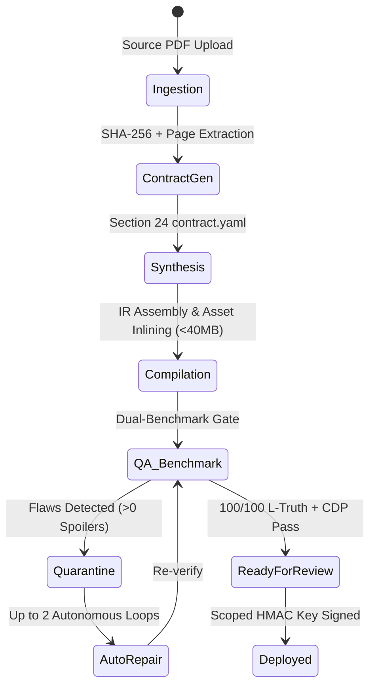
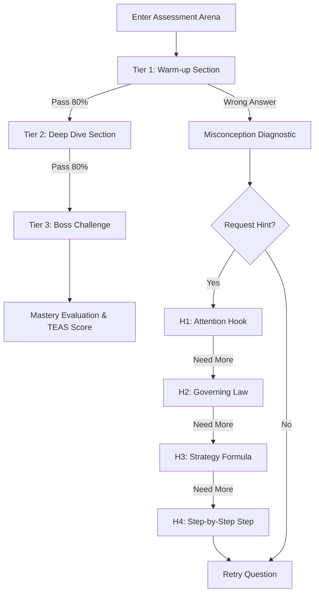

# AASHA AIOS — App Flow & Interaction Specification
**Document Identifier:** `AASHA-SPEC-03-APP-FLOW`  
**Classification:** Canonical User Experience Flow  
**Version:** 2.0.0 (Unified Ecosystem Release)  
**Lifecycle Status:** APPROVED / LEVEL 1 SPECIFICATION  

---

## 1. System-Wide State Transition Overview

The AASHA ecosystem orchestrates three interconnected workflows:
1. **Pipeline Ingestion & Compilation Flow** (Autonomous Engine)
2. **Learner Engagement & Mastery Flow** (Offline Client HTML5)
3. **Teacher / Super Admin Review Flow** (HIL Gatekeeper Console)

---

## 2. Learner Interaction Flow (Single-Frame Chapter Module)

Every compiled chapter runs inside an offline single-file viewport structured into 4 sequential cards:

### Card 1: Phenomenon Hook & Concept Intro (`#card-concept`)
* **State 1.1: Visual Hook Rendering:** Displays an animated SVG diagram or real-world contextual scenario (e.g., sharing chapatis, calculating farming yield, lever mechanics).
* **State 1.2: Layer A Intuitive Explanation:** Presents simple conversational prose in English with insulated Hindi translation anchors.
* **State 1.3: Bilingual Word-Tap Interaction:**
  * Learner taps any highlighted terminology token.
  * System intercepts tap and renders `#wordDialog` modal with zero page shift.
  * Modal displays Devanagari Hindi word, contextual definition, and phonetic pronunciation guide.
  * Learner taps outside or hits close button; dialog dismisses smoothly.

---

### Card 2: Interactive Simulation Manipulative (`#card-simulation`)
* **State 2.1: Canvas / WebGL Mount:** The `<aasha-sim>` Web Component initializes the matched foundation engine (e.g., AVR Spring Manipulative or CinePhysics Vernier Caliper).
* **State 2.2: Active Manipulation Loop:**
  * Learner interacts with tactile sliders, drag handles, or toggle buttons ($\ge 44 \times 44\text{ px}$).
  * Manipulative state updates internal parameters at 60 FPS.
  * Synchronous DOM text readouts (e.g., `"Force = 12 N"`, `"Fraction = 3/4"`) update synchronously in the same call stack.
  * Telemetry engine emits non-blocking `aasha:telemetry` event to IndexedDB.
* **State 2.3: Phenomenon Confirmation:** When learner discovers the target relationship, the HUD reveals an achievement badge and unlocks Card 3.

---

### Card 3: 3-Tier Gamified Assessment Arena (`#card-assessment`)

#### Detailed Scaffolding Steps:
1. **Tier 1 (Warm-up `#section-warmup`):** 3–5 rapid diagnostic multiple-choice items checking basic recall and conceptual anchors.
2. **Tier 2 (Deep Dive `#section-deep_dive`):** Multi-step scenario problems linked back to the simulation manipulative from Card 2.
3. **Tier 3 (Boss Challenge `#section-boss`):** Advanced textbook challenge problem requiring synthesis of multiple concepts.

#### Diagnostic Error & Hint State Machine:
* **Action:** Student selects an incorrect distractor.
* **Response:**
  * Button pulses with subtle feedback (amber highlight, no harsh red).
  * System displays the pre-embedded diagnostic explanation (`m` attribute) targeting the misconception without revealing the answer.
  * Hint button becomes active (`[Need a Hint?]`).
* **Hint Escalation ($H_1 \rightarrow H_4$):**
  * Click 1 $\rightarrow$ **$H_1$ Hook:** Directs eyes to the critical diagram part.
  * Click 2 $\rightarrow$ **$H_2$ Concept:** States the governing principle.
  * Click 3 $\rightarrow$ **$H_3$ Formula:** Displays the formula structure in KaTeX.
  * Click 4 $\rightarrow$ **$H_4$ Intermediate Step:** Evaluates the initial setup.

---

### Card 4: Mastery & Retention Summary (`#card-summary`)
* Computes the Canonical TEAS Weighted Mastery:
  $$\text{TEAS Score} = 0.60 \times \text{HistoricalScore} + 0.40 \times \text{RecentScore}$$
* Enforces minimum 3 attempts before certification.
* Emits final session summary to local IndexedDB (`aasha_telemetry_db`).

---

## 3. Teacher & Super Admin Review Flow (`multi-agent-tui` / Studio)

1. **Dashboard Overview:** Displays list of compiled chapters with content hashes and QA scores.
2. **4-Pillar Pedagogical Audit Review:**
   * Pillar 1: Golden Flow Verification (WHAT $\rightarrow$ WHY $\rightarrow$ HOW $\rightarrow$ SHOW $\rightarrow$ TRY $\rightarrow$ FEEDBACK $\rightarrow$ CONNECT $\rightarrow$ NAME).
   * Pillar 2: Academic Math Rigor (KaTeX insulation verified).
   * Pillar 3: Misconception Audit (0 spoilers confirmed).
   * Pillar 4: Air-Gapped Child Safety (0 remote CDNs, $\le 40\text{MB}$ size).
3. **Instant Browser Preview (`[O]`):** Opens the chapter in headless Chrome to verify real-time layout and interactivity.
4. **Final Sign-Off (`[S]`):** Signs the chapter release manifest using HMAC credentials from `AASHA_HIL_TRUSTED_KEYS_JSON`.
