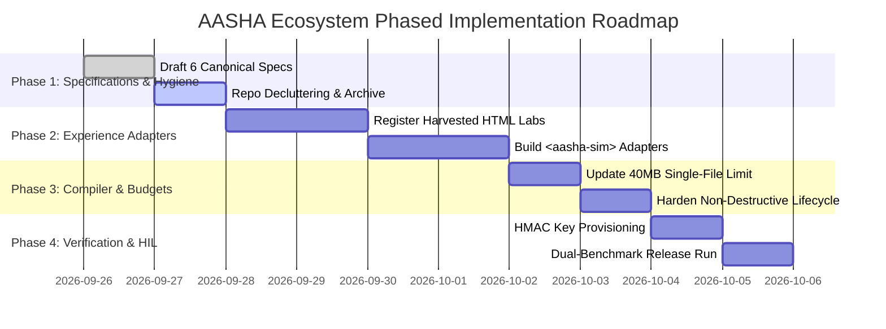

# AASHA AIOS — Implementation & Certification Roadmap
**Document Identifier:** `AASHA-SPEC-06-IMPLEMENTATION-PLAN`  
**Classification:** Canonical Implementation Plan  
**Version:** 2.0.0 (Unified Ecosystem Release)  
**Lifecycle Status:** APPROVED / LEVEL 1 SPECIFICATION  
**Governance Authority:** Super Admin AIOS Orchestrator & HIL Gatekeeper

---

## 1. Executive Implementation Phasing



---

## 2. Phase-by-Phase Execution Breakdown

### Phase 1: Specification Consolidation & Repository Hygiene
* **Objective:** Establish unambiguous canonical documentation and isolate loose experimental scripts into `.archive/`.
* **Deliverables:**
  * The 6 Canonical Specification Blueprints created in `docs/specs/`.
  * Clean repository directory structure: `packages/`, `content/`, `experience_registry/`, `benchmarks/`, `docs/specs/`.
  * Archival of legacy one-off test scripts and temporary news scrapers into `.archive/`.

### Phase 2: Harvested Visual Experience Registry & Adapter Binding
* **Objective:** Transform harvested visual assets (`AASHA_Visual_Mass_Harvest_Phase3/` and `external_sources/CinePhysicsHQ-Labs/`) into certified, reusable `<aasha-sim>` Web Component adapters.
* **Deliverables:**
  * Update `experience_registry/registry.json` with 22+ harvested component entries.
  * Implement adapter classes extending `AashaExperienceAdapter` (`mount`, `getState`, `pause`, `resume`, `reset`, `destroy`, `emitTelemetry`).
  * Verify offline self-containment (zero external CDN references).

### Phase 3: Single-File HTML5 Compiler Hardening (40 MB Ceiling)
* **Objective:** Update compiler guards and version management to enforce the expanded **40 MB ceiling** (`41,943,040 bytes`).
* **Deliverables:**
  * Modify `CHILD_HTML5_BUNDLE_MAX_BYTES = 41_943_040` in `packages/aios/version_manager.ts` and `v6_compiler.ts`.
  * Validate smart inlining: Raw `<script>` and `<style>` inlined directly; Base64 strictly for binary assets.
  * Enforce non-destructive `pause()` / `resume()` handlers across all card navigation transitions ($\ge 4\text{ GB RAM}$ invariant).

### Phase 4: Cryptographic HIL Key Provisioning & Dual-Benchmark Certification Gate
* **Objective:** Unblock release certification through authenticated Super Admin credentials and comprehensive multi-viewport verification.
* **Deliverables:**
  * Provision `AASHA_HIL_TRUSTED_KEYS_JSON` in local environment configuration.
  * Execute Dual-Benchmark Quality Certification:
    1. Static L-Truth QA (`qa_ltruth_benchmark.js`): 100/100 score, 0 answer spoilers in `m` attributes, 0 math-rt collisions.
    2. Headless Chrome CDP Automation (`verify_square_cube_cdp.js`): 0 console errors, 100% Hindi word-tap modal opens, and zero page scroll (`scrollH <= winH + 5`) across 16:9, 19.5:9, and 20:9 viewports.
  * Super Admin final sign-off (`[S]`) and immutable version ledger promotion.

---

## 3. Bounded 2-Tier Autonomous Repair Loop Invariant

To guarantee deterministic termination and eliminate infinite self-correction loops:
1. **Invocation Ceiling:**
   $$\text{INITIAL\_INVOCATION} = 1, \quad \text{MAX\_AUTONOMOUS\_REPAIRS} = 2 \implies \text{MAX\_TOTAL\_ATTEMPTS} = 3$$
2. **Quarantine Activation:**
   * If benchmark tests fail after the 2nd autonomous repair attempt, execution halts immediately.
   * Emits structured `QuarantinePacket` containing failure diagnostics:
     ```json
     {
       "quarantine_id": "quar_20260926_01",
       "actionRequired": "SUPER_ADMIN_INTERVENTION",
       "flaw_type": "BENCHMARK_FAILURE",
       "failed_assertions": ["Distractor 'ex:11.1.w1' contains answer leak 'yields 2'"],
       "blocked_downstream_stages": ["COMPILER", "DEPLOYMENT"]
     }
     ```
   * Quarantined candidate artifacts are **strictly blocked from entering the permanent experience memory bank**, preventing memory pollution.

---

## 4. Verification Checkpoints & Sign-Off Commands

| Milestone | Execution Command | Success Criteria |
|---|---|---|
| **Contract Validation** | `npm run chapter:init -- "Physics" 8 "Force"` | Section 24 contract generated with matched foundation |
| **L-Truth QA Benchmark** | `npm run test:ltruth` | 100/100 score, 0 spoilers, 0 math collisions |
| **CDP Multi-Viewport Run** | `node verify_square_cube_cdp.js` | 0 console errors, `scrollH <= winH + 5` on all 5 viewports |
| **Version Snapshot** | `npm run version:snapshot -- <chapter.html>` | SHA-256 registered, byte size $\le 41,943,040\text{ bytes}$ |
| **HIL Scoped Sign-Off** | `npm run version:verify -- <artifactId>` | HMAC cryptographic signature matched against trusted keys |
